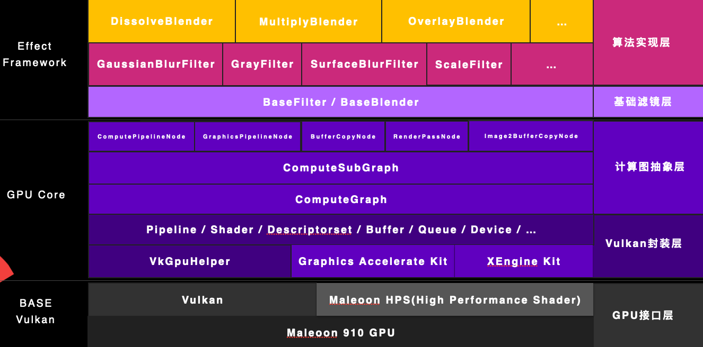

# SGL (Simple GPU Layer)

High-Performance GPU Compute Engine Based on Vulkan


---

## 基础框架使用

以两个`100000000`个浮点数的向量`float input1[100000000]`, `float input2[100000000]`逐元素相加为例

### 1. 初始化GPU与计算图

```c++
std::vector<const char *> extensions = {};
VkGPUContext gpuCtx(extensions);
gpuCtx.Init();
ComputeGraph computeGraph(gpuCtx);
SubComputeGraph computeSubGraph(gpuCtx);
computeSubGraph.Init();
computeGraph.AddSubGraph(computeSubGraph);
```

### 2. 创建计算/渲染节点

```c++
std::vector<VkDescriptorSetLayoutBinding> descriptorSetLayoutBindings;
descriptorSetLayoutBindings.push_back(VkGPUHelper::BuildDescriptorSetLayoutBinding(0, VK_DESCRIPTOR_TYPE_STORAGE_BUFFER, 1, VK_SHADER_STAGE_COMPUTE_BIT));
descriptorSetLayoutBindings.push_back(VkGPUHelper::BuildDescriptorSetLayoutBinding(1, VK_DESCRIPTOR_TYPE_STORAGE_BUFFER, 1, VK_SHADER_STAGE_COMPUTE_BIT));
descriptorSetLayoutBindings.push_back(VkGPUHelper::BuildDescriptorSetLayoutBinding(2, VK_DESCRIPTOR_TYPE_STORAGE_BUFFER, 1, VK_SHADER_STAGE_COMPUTE_BIT));
                                                     
ComputePipelineNode addNode(gpuCtx, "Add", SHADER(add.comp.glsl.spv), 0, descriptorSetLayoutBindings, (100000000 + 255) / 256, 1, 1);
addNode->CreateComputeGraphNode();
```

编写`shader`

```glsl
#version 450
layout (local_size_x = 256, local_size_y = 1, local_size_z = 1) in;
layout (std430, binding = 0) buffer InputStorageBuffer {
    float data[];
} inputBuffer;
layout (std430, binding = 1) buffer InputStorageBuffer2 {
    float data[];
} inputBuffer2;
layout (std430, binding = 2) buffer OutputStorageBuffer {
    float data[];
} outputBuffer;

void main() {
    uvec2 coord = gl_GlobalInvocationID.xy;
    if (coord.x >= inputBuffer.data.length()) {
        return;
    }
    float x1 = inputBuffer.data[coord.x];
    float x2 = inputBuffer2.data[coord.x];
    outputBuffer.data[coord.x] = x1 + x2;
}
```

### 3. 申请GPU内存并添加计算数据到计算节点

```c++
VkGPUBuffer inputBuffer(gpuCtx);
inputBuffer.AllocateAndBind(GPU_BUFFER_TYPE_STORAGE_SHARED, 100000000 * sizeof(float));
VkGPUBuffer inputBuffer2(gpuCtx);
inputBuffer2.AllocateAndBind(GPU_BUFFER_TYPE_STORAGE_SHARED, 100000000 * sizeof(float));
VkGPUBuffer outputBuffer(gpuCtx);
outputBuffer.AllocateAndBind(GPU_BUFFER_TYPE_STORAGE_SHARED, 100000000 * sizeof(float));
 
inputBuffer.UploadData(input1, 100000000 * sizeof(float));
inputBuffer2.UploadData(input2, 100000000 * sizeof(float));
 
std::vector<PipelineNodeBuffer> ppBuffers;
ppBuffers.push_back({ .type = PIPELINE_NODE_BUFFER_STORAGE_READ, .buf = { .bufferSize = inputBuffer->GetBufferSize(), .buffer = inputBuffer->GetBuffer()}});
ppBuffers.push_back({ .type = PIPELINE_NODE_BUFFER_STORAGE_READ, .buf = { .bufferSize = inputBuffer2->GetBufferSize(), .buffer = inputBuffer2->GetBuffer()}});
ppBuffers.push_back({ .type = PIPELINE_NODE_BUFFER_STORAGE_WRITE, .buf = { .bufferSize = outputBuffer->GetBufferSize(), .buffer = outputBuffer->GetBuffer()}});
addNode->AddComputeElement({ .pushConstantInfo = {}, .buffers = ppBuffers, .customDrawFunc = nullptr);
computeSubGraph->AddComputeGraphNode(bezierNode);
```

### 4. 计算

```c++
computeGraph.Compute();
```

### 5. 获取结果

```c++
outputBuffer.MapBuffer();
float *result = outputBuffer.GetMappedAddr();
```

---

## 图像处理算子使用

### 1. 初始化滤镜框架

```c++
EffectEngine effectEngine;
effectEngine.Init();
```

### 2. 使用滤镜

以高斯模糊为例

```c++
const auto filter = std::make_shared<FastGaussianBlurFilter>();
filter->SetRadius(120);
ImageInfo 
effectEngine.Process({.width = 1024, .height = 768, .channels = 4 .bytesPerLine = 4 * 1024, .data = inputPixelData}, {.width = 1024, .height = 768, .channels = 4 .bytesPerLine = 4 * 1024, .data = outputPixelData}, filter);
```

目前内置的效果有

- [chinese_paint](https://gitcode.com/OpenHarmonyPerfSquad/SGL/blob/main/engine/effect/assets/builtin.shaders/effects/chinese_paint.comp.glsl)
- [color_pencil_sketch](https://gitcode.com/OpenHarmonyPerfSquad/SGL/blob/main/engine/effect/assets/builtin.shaders/effects/color_pencil_sketch.comp.glsl)
- [color_separation](https://gitcode.com/OpenHarmonyPerfSquad/SGL/blob/main/engine/effect/assets/builtin.shaders/effects/color_separation.comp.glsl)
- [crystallize](https://gitcode.com/OpenHarmonyPerfSquad/SGL/blob/main/engine/effect/assets/builtin.shaders/effects/crystallize.comp.glsl)
- [custom_kernel](https://gitcode.com/OpenHarmonyPerfSquad/SGL/blob/main/engine/effect/assets/builtin.shaders/effects/custom_kernel.comp.glsl)
- [filter.templete](https://gitcode.com/OpenHarmonyPerfSquad/SGL/blob/main/engine/effect/assets/builtin.shaders/effects/filter.templete.comp.glsl)
- [focus_blur](https://gitcode.com/OpenHarmonyPerfSquad/SGL/blob/main/engine/effect/assets/builtin.shaders/effects/focus_blur.comp.glsl)
- [gray](https://gitcode.com/OpenHarmonyPerfSquad/SGL/blob/main/engine/effect/assets/builtin.shaders/effects/gray.comp.glsl)
- [horizontal_blur_old](https://gitcode.com/OpenHarmonyPerfSquad/SGL/blob/main/engine/effect/assets/builtin.shaders/effects/horizontal_blur_old.comp.glsl)
- [horizontal_blur](https://gitcode.com/OpenHarmonyPerfSquad/SGL/blob/main/engine/effect/assets/builtin.shaders/effects/horizontal_blur.comp.glsl)
- [midvalue](https://gitcode.com/OpenHarmonyPerfSquad/SGL/blob/main/engine/effect/assets/builtin.shaders/effects/midvalue.comp.glsl)
- [nes8bit](https://gitcode.com/OpenHarmonyPerfSquad/SGL/blob/main/engine/effect/assets/builtin.shaders/effects/nes8bit.comp.glsl)
- [palette_knife](https://gitcode.com/OpenHarmonyPerfSquad/SGL/blob/main/engine/effect/assets/builtin.shaders/effects/palette_knife.comp.glsl)
- [palette_q](https://gitcode.com/OpenHarmonyPerfSquad/SGL/blob/main/engine/effect/assets/builtin.shaders/effects/palette_q.comp.glsl)
- [pathblur](https://gitcode.com/OpenHarmonyPerfSquad/SGL/blob/main/engine/effect/assets/builtin.shaders/effects/pathblur.comp.glsl)
- [radial_blur](https://gitcode.com/OpenHarmonyPerfSquad/SGL/blob/main/engine/effect/assets/builtin.shaders/effects/radial_blur.comp.glsl)
- [scale](https://gitcode.com/OpenHarmonyPerfSquad/SGL/blob/main/engine/effect/assets/builtin.shaders/effects/scale.comp.glsl)
- [surface_blur](https://gitcode.com/OpenHarmonyPerfSquad/SGL/blob/main/engine/effect/assets/builtin.shaders/effects/surface_blur.comp.glsl)
- [templete](https://gitcode.com/OpenHarmonyPerfSquad/SGL/blob/main/engine/effect/assets/builtin.shaders/effects/templete.comp.glsl)
- [threshold_split](https://gitcode.com/OpenHarmonyPerfSquad/SGL/blob/main/engine/effect/assets/builtin.shaders/effects/threshold_split.comp.glsl)
- [transform](https://gitcode.com/OpenHarmonyPerfSquad/SGL/blob/main/engine/effect/assets/builtin.shaders/effects/transform.comp.glsl)
- [transform3d.frag](https://gitcode.com/OpenHarmonyPerfSquad/SGL/blob/main/engine/effect/assets/builtin.shaders/effects/transform3d.frag.glsl)
- [transform3d.vert](https://gitcode.com/OpenHarmonyPerfSquad/SGL/blob/main/engine/effect/assets/builtin.shaders/effects/transform3d.vert.glsl)
- [vertical_blur_old](https://gitcode.com/OpenHarmonyPerfSquad/SGL/blob/main/engine/effect/assets/builtin.shaders/effects/vertical_blur_old.comp.glsl)
- [vertical_blur](https://gitcode.com/OpenHarmonyPerfSquad/SGL/blob/main/engine/effect/assets/builtin.shaders/effects/vertical_blur.comp.glsl)
- [vibrance](https://gitcode.com/OpenHarmonyPerfSquad/SGL/blob/main/engine/effect/assets/builtin.shaders/effects/vibrance.comp.glsl)
- [voronoi](https://gitcode.com/OpenHarmonyPerfSquad/SGL/blob/main/engine/effect/assets/builtin.shaders/effects/voronoi.comp.glsl)

### 自定义滤镜

参考`基础框架使用`即可

---

## 机器学习算子使用

### 1. 初始化

### 2. 矩阵初始化

### 3. 使用算子
```c++
 const std::shared_ptr<Sequence> seq = mle->Seq()
            ->Record(mle->LayerNorm(inputsMatrix[tokenPos],
                                    this->inputLayerNorm,
                                    biasMatrix,
                                    1e-06,
                                    true,
                                    false,
                                    inputLayerNormOutput[tokenPos]))
            ->Record(mle->MatMul(inputLayerNormOutput[tokenPos], selfAttnQProj, qProjOutput[tokenPos]))
            ->Record(mle->MatMul(inputLayerNormOutput[tokenPos], selfAttnKProj, kProjOutput[tokenPos]))
            ->Record(mle->MatMul(inputLayerNormOutput[tokenPos], selfAttnVProj, vProjOutput[tokenPos]))
            ->Record(mle->Split(qProjOutput[tokenPos], queryHeadNums, qHeads[tokenPos]))
            ->Eval()
            ->Destroy();
```

目前内置的算子有：

- [add](https://gitcode.com/OpenHarmonyPerfSquad/SGL/blob/main/engine/ml/assets/builtin.shaders/operators/add.comp.glsl)
- [concat8](https://gitcode.com/OpenHarmonyPerfSquad/SGL/blob/main/engine/ml/assets/builtin.shaders/operators/concat8.comp.glsl)
- [concat16](https://gitcode.com/OpenHarmonyPerfSquad/SGL/blob/main/engine/ml/assets/builtin.shaders/operators/concat16.comp.glsl)
- [gelu](https://gitcode.com/OpenHarmonyPerfSquad/SGL/blob/main/engine/ml/assets/builtin.shaders/operators/gelu.comp.glsl)
- [layer_norm](https://gitcode.com/OpenHarmonyPerfSquad/SGL/blob/main/engine/ml/assets/builtin.shaders/operators/layer_norm.comp.glsl)
- [matmul](https://gitcode.com/OpenHarmonyPerfSquad/SGL/blob/main/engine/ml/assets/builtin.shaders/operators/matmul.comp.glsl)
- [mul](https://gitcode.com/OpenHarmonyPerfSquad/SGL/blob/main/engine/ml/assets/builtin.shaders/operators/mul.comp.glsl)
- [relu](https://gitcode.com/OpenHarmonyPerfSquad/SGL/blob/main/engine/ml/assets/builtin.shaders/operators/relu.comp.glsl)
- [rms_norm](https://gitcode.com/OpenHarmonyPerfSquad/SGL/blob/main/engine/ml/assets/builtin.shaders/operators/rms_norm.comp.glsl)
- [rope](https://gitcode.com/OpenHarmonyPerfSquad/SGL/blob/main/engine/ml/assets/builtin.shaders/operators/rope.comp.glsl)
- [scale_d](https://gitcode.com/OpenHarmonyPerfSquad/SGL/blob/main/engine/ml/assets/builtin.shaders/operators/scale_d.comp.glsl)
- [sigmoid](https://gitcode.com/OpenHarmonyPerfSquad/SGL/blob/main/engine/ml/assets/builtin.shaders/operators/sigmoid.comp.glsl)
- [silu](https://gitcode.com/OpenHarmonyPerfSquad/SGL/blob/main/engine/ml/assets/builtin.shaders/operators/silu.comp.glsl)
- [softmax](https://gitcode.com/OpenHarmonyPerfSquad/SGL/blob/main/engine/ml/assets/builtin.shaders/operators/softmax.comp.glsl)
- [split8](https://gitcode.com/OpenHarmonyPerfSquad/SGL/blob/main/engine/ml/assets/builtin.shaders/operators/split8.comp.glsl)
- [split16](https://gitcode.com/OpenHarmonyPerfSquad/SGL/blob/main/engine/ml/assets/builtin.shaders/operators/split16.comp.glsl)
- [tanh](https://gitcode.com/OpenHarmonyPerfSquad/SGL/blob/main/engine/ml/assets/builtin.shaders/operators/tanh.comp.glsl)

### 4. 计算
